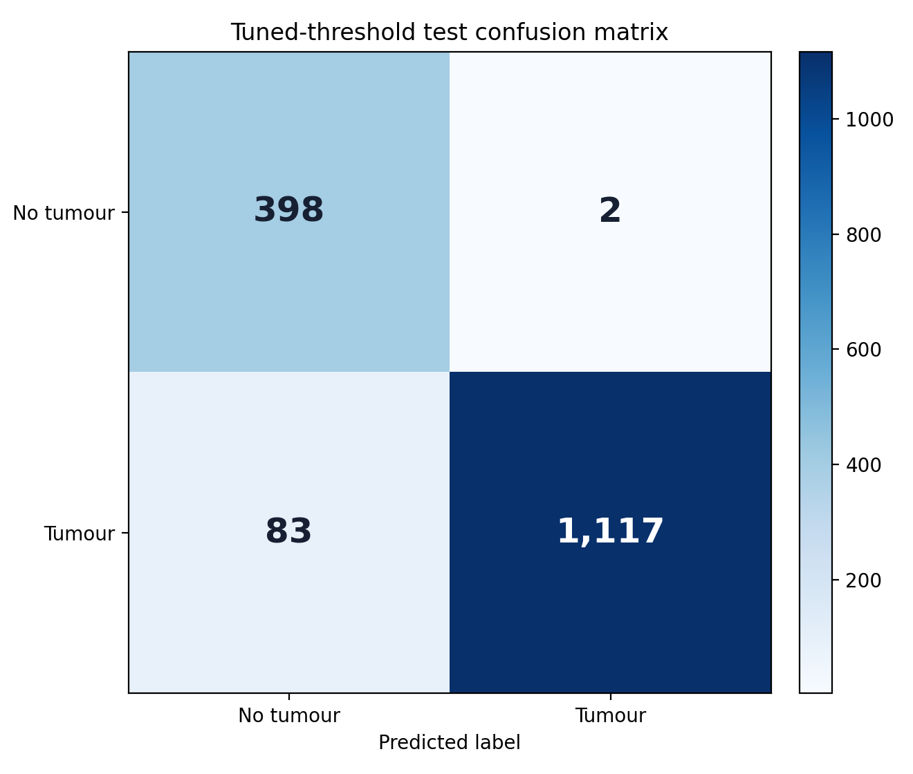
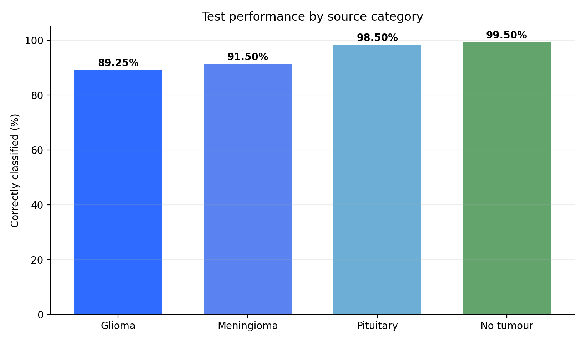
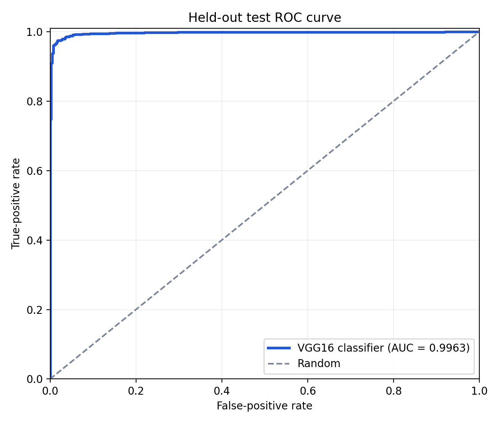

# Brain Tumour MRI Classifier

An experimental binary image classifier that uses VGG16 transfer learning to distinguish brain MRI images labelled **tumour** from those labelled **no tumour**. The project includes a reproducible evaluation record, validation-selected decision threshold, subtype error analysis, figure-generation script, and Streamlit inference interface.

> **Educational use only:** this project is not a medical device, does not provide a diagnosis, and has not been clinically validated. Its outputs must not be used to make healthcare decisions.

## Results

The final decision threshold (`0.287156`) was selected on the validation set to reach at least 97% tumour recall while minimizing false positives. The threshold was then locked and applied to the held-out test set.

| Metric | Held-out test result |
|---|---:|
| Images | 1,600 |
| Accuracy | **94.69%** |
| ROC-AUC | **0.9963** |
| Precision | **99.82%** |
| Recall / sensitivity | **93.08%** |
| Specificity | **99.50%** |
| F1-score | **96.33%** |

Threshold calibration reduced false negatives from 109 to 83, a **23.9% reduction**, while increasing false positives from one to two.

The ROC-AUC reported here is the exact score-level value calculated from the saved test predictions with scikit-learn (`0.996285`). TensorFlow's streaming evaluation displayed `0.9917` because it approximated AUC over a finite threshold grid.



### Performance by source category

| Source category | Correct | Errors | Correctly classified |
|---|---:|---:|---:|
| Glioma | 357/400 | 43 | 89.25% |
| Meningioma | 366/400 | 34 | 91.50% |
| Pituitary | 394/400 | 6 | 98.50% |
| No tumour | 398/400 | 2 | 99.50% |



Glioma and meningioma accounted for 77 of the 83 remaining false negatives. This is the model's clearest observed limitation.

When `artifacts/evaluation_probabilities.npz` is present, the reporting script also produces the held-out test ROC curve:



## Dataset

The images originated from Masoud Nickparvar's [Brain Tumor MRI Dataset on Kaggle](https://www.kaggle.com/datasets/masoudnickparvar/brain-tumor-mri-dataset). The working archive used in this project contained 7,200 MRI images:

| Split | Glioma | Meningioma | Pituitary | No tumour | Total |
|---|---:|---:|---:|---:|---:|
| Original training folder | 1,400 | 1,400 | 1,400 | 1,400 | 5,600 |
| Held-out testing folder | 400 | 400 | 400 | 400 | 1,600 |

The original 5,600-image training folder was divided reproducibly into 4,480 training and 1,120 validation images using stratification and random seed 42. The three tumour categories were combined into one positive class, creating a 3:1 tumour-to-no-tumour binary class ratio.

The repository does not redistribute the MRI files. Users must review and comply with the licence and usage terms shown on the Kaggle source page before downloading or reusing the dataset.

## Method

1. MRI images were read in grayscale and resized to 128 × 128 pixels.
2. Grayscale images were converted to three channels inside the model for VGG16 compatibility.
3. A VGG16 backbone pretrained on ImageNet was frozen for transfer learning.
4. The classification head used global average pooling, a 128-unit ReLU layer with L2 regularization, 50% dropout, and a sigmoid output.
5. Training used rotation, zoom and contrast augmentation, weighted binary cross-entropy, Adam, early stopping, learning-rate reduction, and best-checkpoint saving.
6. Model selection used validation ROC-AUC. The supplied testing folder remained separate until final evaluation.
7. The decision threshold was selected using validation predictions only, then applied once to test predictions.

The KMeans pseudo-masks explored during early preprocessing were **not used** by the final classifier. This project does not perform segmentation or tumour localization.

## Run the application

### 1. Create an environment

```bash
python -m venv .venv
```

Activate it, then install dependencies:

```bash
pip install -r requirements.txt
```

### 2. Add the portable model

Place the verified model at:

```text
models/best_vgg16_tumor_classifier_portable.keras
```

Alternatively, set `BRAIN_TUMOR_MODEL_PATH` to its absolute location.

### 3. Start Streamlit

```bash
streamlit run app.py
```

The interface accepts JPG, JPEG, PNG and BMP images. It reproduces the grayscale resizing and normalization used during evaluation and applies the locked threshold of `0.287156`.

## Regenerate evaluation figures

Copy `evaluation_probabilities.npz` into `artifacts/`, then run:

```bash
python reports/generate_figures.py
```

This creates the tuned confusion matrix, ROC curve, and category-performance chart under `docs/figures/`.

## Testing

```bash
pip install -r requirements-dev.txt
pytest
```

The automated tests check image preprocessing and the saved threshold configuration. Full model inference is validated separately because TensorFlow model loading is comparatively expensive.

## Repository structure

```text
.
├── app.py                         # Streamlit interface
├── artifacts/                     # Threshold, metrics and saved probabilities
├── docs/figures/                  # Portfolio-ready evaluation figures
├── models/                        # Portable model stored locally or through LFS/releases
├── notebooks/                     # Training notebook location
├── reports/generate_figures.py    # Rebuild evaluation plots
├── src/inference.py               # Model loading and scoring
├── src/preprocessing.py           # Shared image preprocessing
├── tests/                         # Lightweight automated tests
├── MODEL_CARD.md                  # Intended use and limitations
└── requirements.txt
```

## Limitations

- Performance was measured on one supplied dataset and has not been externally validated.
- The split was performed at image level because patient identifiers were unavailable. Related images could therefore appear across splits, potentially inflating performance.
- The testing-folder distribution is artificial and should not be interpreted as real-world disease prevalence.
- The model performs binary classification only; it does not identify tumour subtype, location, size, grade, or clinical significance.
- The sigmoid score is a model output, not a calibrated medical probability.
- Glioma and meningioma images produced most false negatives.
- Performance may change under different scanners, acquisition settings, populations, preprocessing, compression, or image quality.

## License

The original source code and documentation in this repository are available under the MIT License.

The MRI dataset, third-party libraries, pretrained VGG16 components, and other external assets remain subject to their respective licenses and terms. This repository does not redistribute the original dataset.

See [MODEL_CARD.md](MODEL_CARD.md) for the full responsible-use statement.
- Achieved 94.7% test accuracy, 0.9963 ROC-AUC, 99.8% precision and 93.1% recall on 1,600 held-out images; reduced false negatives by 23.9% through validation-based threshold calibration and conducted tumour-category error analysis.
